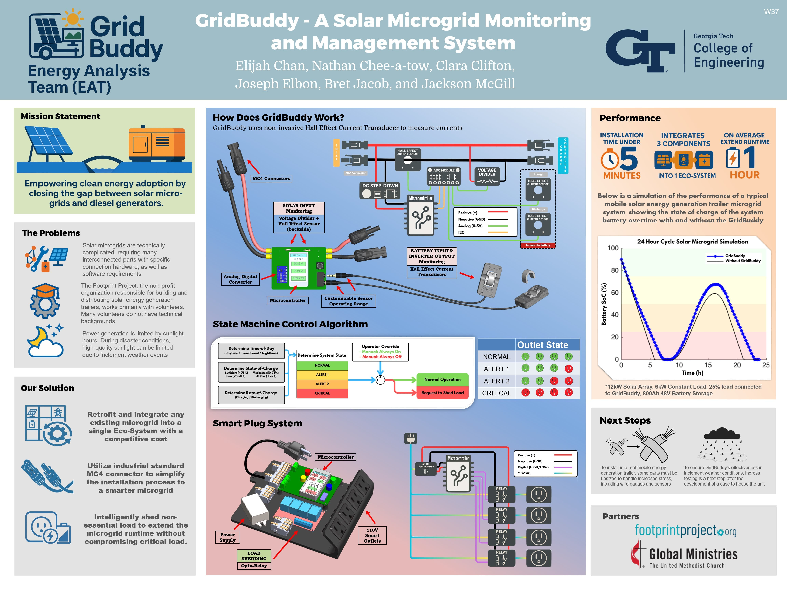
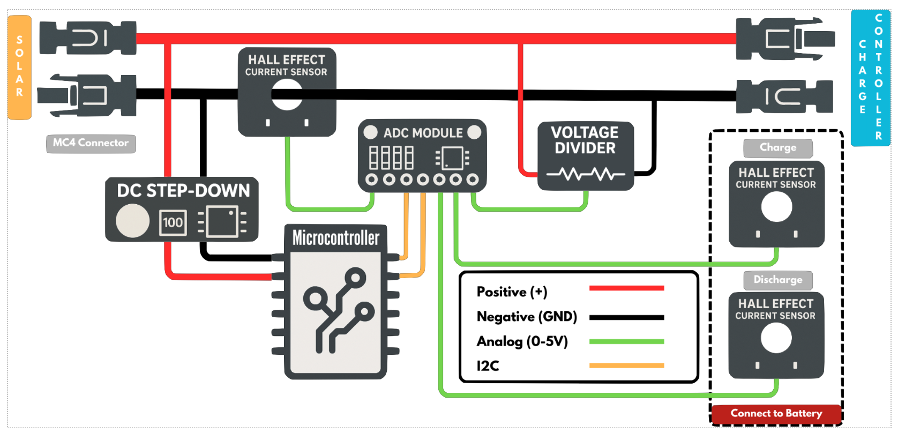
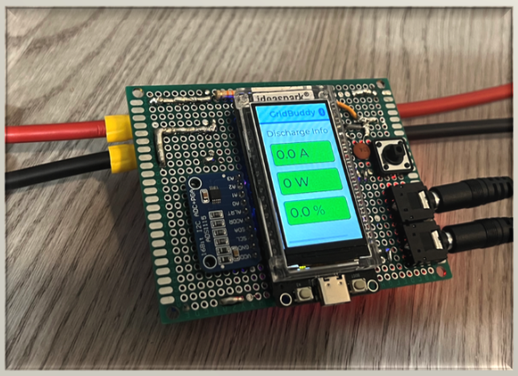
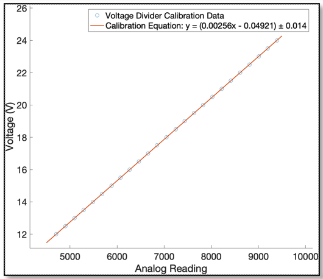
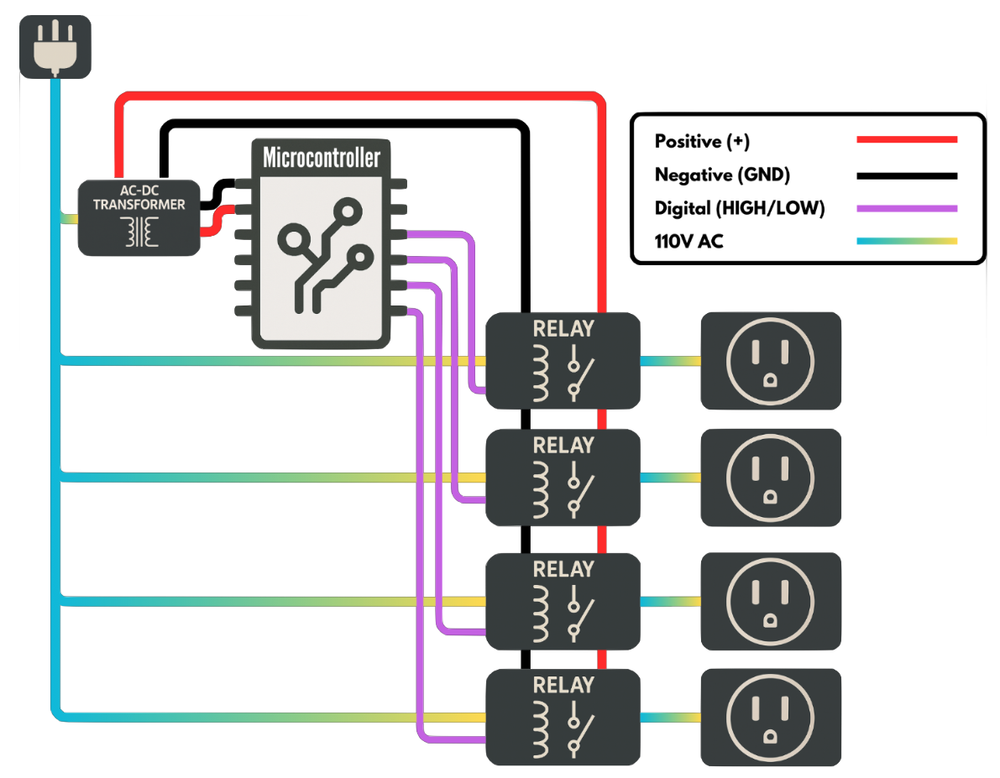
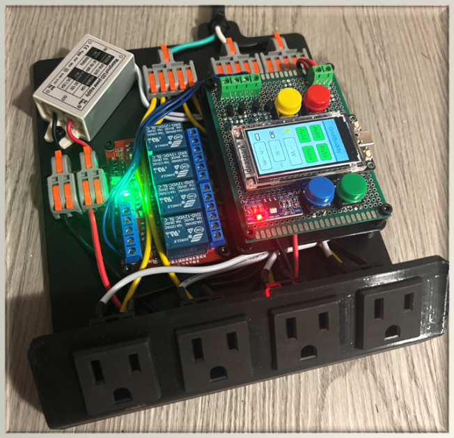
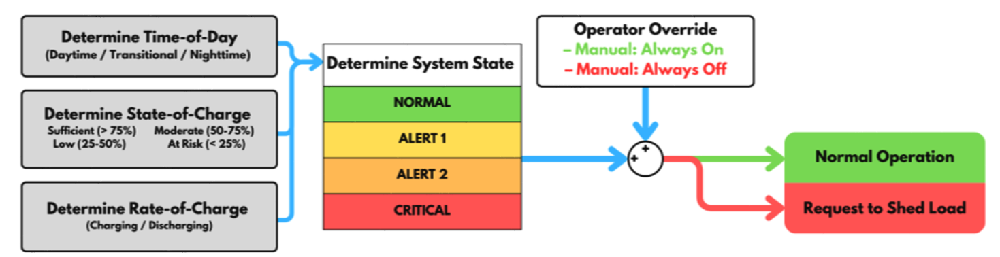

# GridBuddy — Solar Microgrid Monitoring & Management

GridBuddy is a solar microgrid monitoring and management system designed to **retrofit existing solar trailers** and help operators (often non-technical volunteers) understand system status at a glance and **extend runtime** by intelligently shedding non-essential loads.

Developed as part of the Georgia Tech undergraduate capstone project in Mechanical Engineering. Spring 2025

  

---

## What’s in this repo

This repository contains multiple PlatformIO firmware modules that together form the GridBuddy prototype:

- `monitoring_module/` — DC-side sensing + on-device display
- `priority_switch_module/` — load-shedding decision logic / state machine
- `remote_module/` — smart-plug / outlet control

> Each folder is its own PlatformIO project (see each module’s `platformio.ini`).

---

## System Overview (Technical)

GridBuddy is split into two major subsystems:

1. **Monitoring Module (DC side)**  
   Measures PV/battery electrical quantities using **non-invasive Hall-effect current sensing** and a **voltage divider**, digitized with a high-resolution external ADC and displayed locally on an ESP32-based UI.

2. **Smart Plug Module (AC side)**  
   Controls multiple AC outlets through relays (with manual override + automatic mode) to **shed non-essential loads** when battery conditions require it.

The modules communicate via ESP32 wireless telemetry/control.

---

## Monitoring Module (DC-side sensing)

### Hardware
- **Microcontroller:** ESP32  
- **External ADC:** **ADS1115 (16-bit) over I²C** for improved resolution vs. typical on-board ADCs  
- **Voltage measurement:** resistive divider scales high DC bus voltage into the ADC input range  
- **Current measurement:** non-invasive Hall-effect current sensor(s) (PV input; optional battery charge/discharge channels)  
- **Power estimation:** computed from measured `V` and `I`  
- **Retrofit-friendly wiring:** inline install with **MC4 connectors**

### Monitoring wiring / signal flow (block diagram)

  

### Monitoring physical prototype (packaging / interfaces)

  

### Sensor calibration (used in firmware)

These plots show the calibration relationships used to convert raw analog/ADC readings into physical units:

  

  <em>Hall-effect current sensor calibration: analog reading (mV) → current (A) using a fitted linear model.</em>

  

  <em>Voltage divider calibration: analog reading → bus voltage (V) using a fitted linear model.</em>

---

## Smart Plug Module (AC-side load shedding)

### Hardware + behavior
- **Microcontroller:** ESP32  
- **Power chain:** 110 VAC input → AC/DC supply → regulation for logic/relays  
- **Outputs:** multiple relay-controlled outlets (prototype: 4)  
- **Control modes:**
  - **Manual override** via local buttons (force on/off)
  - **Automatic mode** based on a finite-state load-shedding strategy  
- **Stability:** uses **hysteresis** to reduce outlet “chatter”

### Smart plug wiring / signal flow (block diagram)

  

### Smart plug physical prototype (assembly)

  

### Load-shedding state machine

  

**How the state machine works (high level):**
- The controller classifies the system using:
  - **Time-of-day** (day / transitional / night)
  - **Battery state-of-charge** (sufficient → at risk)
  - **Rate-of-charge** (charging vs. discharging)
- These inputs map to a discrete system state (**NORMAL, ALERT 1, ALERT 2, CRITICAL**).
- An **operator override** can force “always on” or “always off.”
- In automatic mode, the module either continues **Normal Operation** or issues a **Request to Shed Load**, which translates to switching one or more outlets off based on priority.

---
